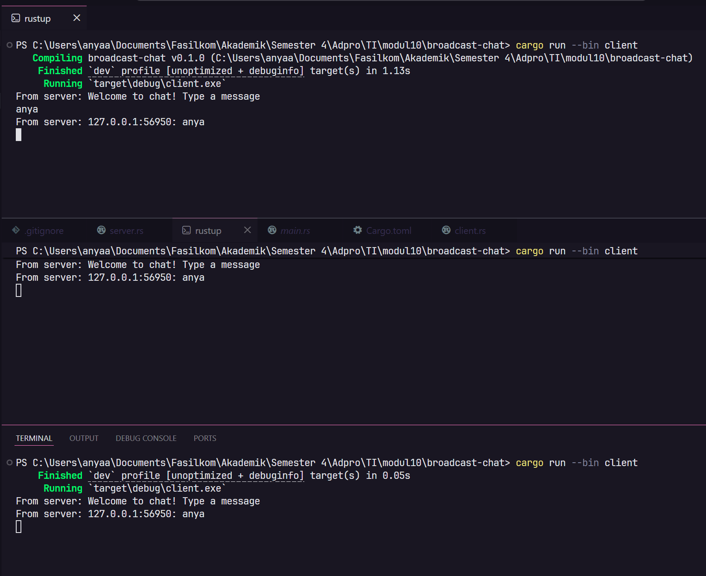
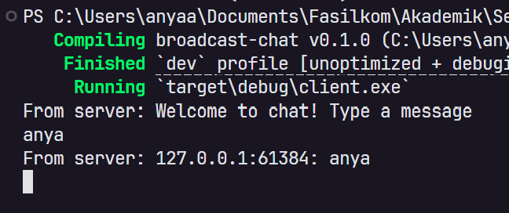
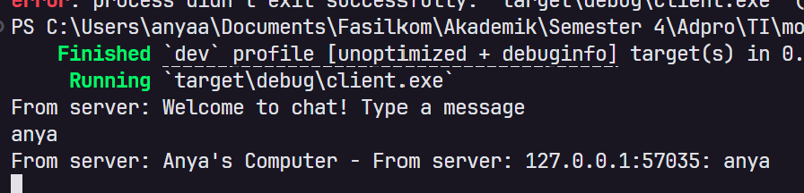

# Reflection

Anya Aleena Wardhany

2406401773

## Experiment 2.1: Original Code, and How It Run



### Cara menjalankan

Buka 4 terminal terpisah, lalu jalankan:

Term 1:

```
cargo run --bin server
```

Term 2, 3, 4:

```
cargo run --bin client
```


Ketika satu client mengetik pesan, server menerima pesan tersebut lalu mem-broadcast ke semua client yang sedang terhubung. Terlihat pada screenshot, ketika client pertama mengetik "anya", pesan tersebut diterima oleh semua client lain dalam format
`127.0.0.1:56950: anya` yaitu IP:Port pengirim diikuti isi pesannya.


Server menggunakan `tokio::broadcast channel` untuk mendistribusikan pesan ke semuasubscriber. Setiap client yang connect akan subscribe ke channel yang sama, sehingga setiap pesan yang masuk akan diterima oleh semua client secara asynchronous.


## Experiment 2.2: Modifying Port



Port diubah dari `2000` ke `8088` karena port `8080` sudah digunakan oleh proses lain di sistem. Perubahan dilakukan di **dua tempat** sekaligus:

- `server.rs` — pada `TcpListener::bind("127.0.0.1:8088")`
- `client.rs` — pada `ClientBuilder::from_uri(Uri::from_static("ws://127.0.0.1:8088"))`

Kedua sisi harus menggunakan port yang sama karena WebSocket adalah protokol connection-based, client harus tahu ke port mana ia harus connect, dan server harus listen di port yang sama. Jika salah satu tidak cocok, koneksi akan gagal.

## Experiment 2.3: Small Changes, Add IP and Port



Modifikasi dilakukan pada `server.rs` di bagian `bcast_tx.send()` dalam fungsi
`handle_connection`. Format pesan yang di-broadcast diubah sehingga menyertakan
informasi pengirim:

```rust
bcast_tx.send(format!("Anya's Computer - From server: {addr}: {text}"))?;
```

Sekarang setiap pesan yang diterima client akan menampilkan IP dan Port pengirimnya,
contohnya `Anya's Computer - From server: 127.0.0.1:57035: anya`. Ini berguna agar
setiap client tahu dari mana pesan itu berasal, karena dalam aplikasi chat kita perlu
tahu identitas pengirim pesan.